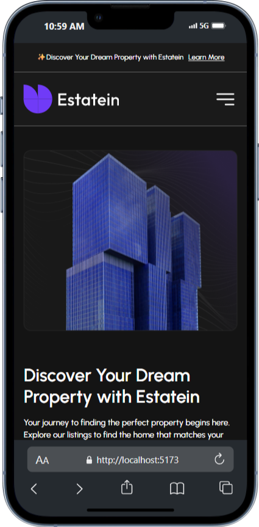

# 🏡 Estatein — Landing Page Properti

**Estatein** adalah landing page modern bertema properti, dibangun menggunakan React dan React Router. Website ini memiliki tampilan elegan dengan font Urbanist dan warna gelap yang profesional.

---

## 📸 Tampilan Website



---

## 🧾 Deskripsi

Project ini menampilkan homepage serta halaman "On Progress" menggunakan routing SPA. Tampilan dikembangkan secara responsif dan stylish menggunakan Tailwind CSS.

---

## 🚀 Fitur Utama

- Halaman Home
- Halaman /onprogress (Coming Soon)
- Navigasi SPA menggunakan React Router
- Desain dark mode elegan
- Font custom (Urbanist)
- Struktur project modular dan scalable

---

## 🛠️ Teknologi yang Digunakan

- ⚛️ React
- 🧭 React Router DOM
- 🎨 Tailwind CSS
- 🔠 Google Fonts: Urbanist
- ⚙️ Vite (module bundler)

---

## 📦 Cara Instalasi & Menjalankan

1. Clone repo ini:

```bash
git clone https://github.com/anamwebdev/estatein.git
cd estatein
```

2. Install dependensi:

```bash
npm install
# atau
yarn install
```

3. Jalankan project:

```bash
npm run dev
```

Lalu buka `http://localhost:5173` di browser.

---

## 📁 Struktur Proyek

```bash
.
├── index.html             # Entry HTML utama
├── src/
│   ├── App.jsx            # Routing utama
│   ├── assets/pages/      # Halaman Home & OnProgress
│   └── main.jsx           # Entry point React
├── public/logo.svg        # Favicon
├── package.json           # Konfigurasi dependensi
└── README.md              # Dokumentasi ini
```

---

## 📄 Lisensi

MIT License © 2025 Samsul Anam

---
